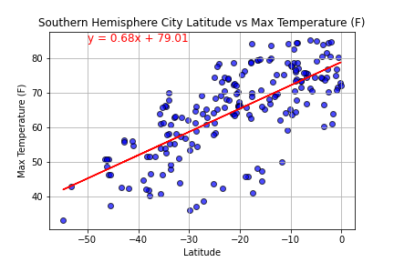
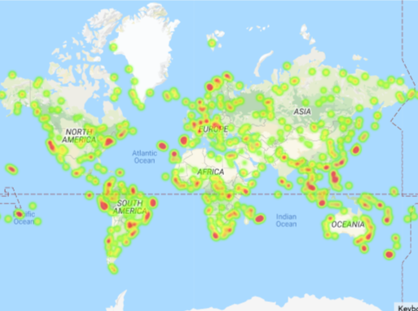

# collin-python-api-challenge
Gather data from APIs then create plots using matplotlib to show the fact that temperatures increase as the get closer to the equator. 

## Software / Libraries
- CSV Files 
- Jupyter Lab
- Python 3
   - Matplotlib
   - Numpy
   - Requests
   - Os
   - Time
   - Scipy
   - Pprint
   - Gmaps
   - Citipy

## APIs Need 
https://openweathermap.org/api

https://mapsplatform.google.com/

**The code will not work unless you create accounts at openweathermap.org and googleapis.com and get api_keys. The first cell in each code references api_keys.py which is not included in the repo because if you use api too much it costs money otherwise the api is free to use. For this reason I did not want to post my api key publicly.**

**If you do create accounts at these websites and get api keys the code in this repo will run without any problems**

## Part I Weather 

**Create various scatterplots of  latitude vs different weather measurements such as cloudiness, humidity, daily max temp, and wind speed for both the Northern and Southern Hemispheres**

**Example of scatterplot: Southern Hemisphere Latitude vs Daily Max Temperature**

**To see the conclusions I made based on this code please see Weather_Conclustions.docx in the 01_Weather directory**

## Part II Vacation

**Create a heat map that displays the humidity for every city from the Weather data** 

**Humidity heat map**

**To see the conclusions I made based on this code please see Weather_Conclustions.docx in the 0_1 Weather directory**

